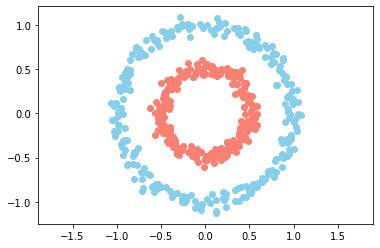
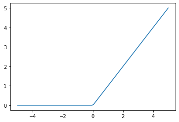
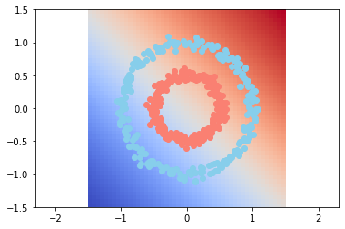
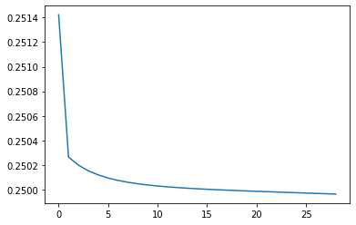

# 05-RED-NEURONAL-2-

```python
import numpy as np
import scipy as sc
import matplotlib.pyplot as plt
from sklearn.datasets import make_circles
```


```python
n = 500
p = 2

X,Y = make_circles(n_samples=n, factor=0.5, noise=0.05)

Y = Y[:, np.newaxis]

plt.scatter(X[Y[:, 0] == 0, 0], X[Y[:, 0] == 0, 1], c="skyblue")
plt.scatter(X[Y[:, 0] == 1, 0], X[Y[:, 0] == 1, 1], c="salmon")

plt.axis("equal")
plt.show()
```





```python
class neural_layer():
    
    def __init__(self, n_conn, n_neur, act_f):
        
        self.act_f = act_f
        
        self.b = np.random.rand(1, n_neur) * 2 - 1
        self.W = np.random.rand(n_conn, n_neur) * 2 -1
```


```python
sigm = (lambda x: 1 / (1 + np.e ** (-x)),
        lambda x: x * (1 - x))

relu = lambda x: np.maximum(0, x)

_x = np.linspace(-5, 5, 100)
plt.plot(_x, relu(_x))
```


    [<matplotlib.lines.Line2D at 0x1a202eca50>]





```python
l0 = neural_layer(p, 4, sigm)
l1 = neural_layer(4, 8, sigm)

def create_nn(topology, act_f):
    
    nn = []
    
    for l, layer in enumerate(topology[:-1]):
        
        nn.append(neural_layer(topology[1], topology[l+1], act_f))
        
    return nn
```


```python
topology = [p, 2, 2, 1]

neural_net = create_nn(topology, sigm)

l2_cost = (lambda Yp, Yr: np.mean((Yp - Yr) ** 2 ),
           lambda Yp, Yr: (Yp - Yr))


def train(neural_net, X, Y, l2_cost, lr=0.5, train=True):
    
    out = [(None, X)]
    
    for l, layer in enumerate(neural_net):
        
        z = out[-1][1] @ neural_net[l].W + neural_net[l].b
        a = neural_net[l].act_f[0](z)
        out.append((z, a))
        
    print(l2_cost[0](out[-1][1], Y))
    
    if train:
        
        deltas = []
        
        for l in reversed(range(0, len(neural_net))):
            
            z = out[l+1][0]
            a = out[l+1][1]
                        
            if l == len(neural_net) - 1:
                deltas.insert(0, l2_cost[1](a, Y) * neural_net[l].act_f[1](a))
            else:
                deltas.insert(0, deltas[0] @ _W.T * neural_net[l].act_f[1](a))
                
            _W = neural_net[l].W 
        
            neural_net[l].b = neural_net[l].b - np.mean(deltas[0], axis=0, keepdims=True) * lr
            neural_net[l].W = neural_net[l].W - out[l][1].T @ deltas[0] * lr

            
    return out[-1][1]

train(neural_net, X, Y, l2_cost, 0.5)
print()
```

    0.252556431558511
    


```python
import time
from IPython.display import clear_output

neural_n = create_nn(topology, sigm)

loss = []

for i in range(2000):
    pY = train(neural_n, X, Y, l2_cost, lr=0.03)
    
    if i % 25 == 0:
        
        loss.append(l2_cost[0](pY, Y))
        
    res = 50
    
    _x0 = np.linspace(-1.5, 1.5, res)
    _x1 = np.linspace(-1.5, 1.5, res)
    
    _Y = np.zeros((res, res))
    
    for i0, x0 in enumerate(_x0):
        for i1, x1 in enumerate(_x1):
            _Y[i0, i1] = train(neural_n, np.array([[x0, x1]]), Y, l2_cost, train=False)[0][0]
            
    plt.pcolormesh(_x0, _x1, _Y, cmap="coolwarm")
    plt.axis("equal")
    
    plt.scatter(X[Y[:, 0] == 0, 0], X[Y[:, 0] == 0, 1], c="skyblue")
    plt.scatter(X[Y[:, 0] == 1, 0], X[Y[:, 0] == 1, 1], c="salmon")
    
    clear_output(wait=True)
    plt.show()
    plt.plot(range(len(loss)), loss)
    plt.show()
    time.sleep(0.5)
    print(_Y)
```








    [[0.49087534 0.49098763 0.49110281 ... 0.49957234 0.49981472 0.50005738]
     [0.49096969 0.49108527 0.49120381 ... 0.49981444 0.5000571  0.50029983]
     [0.49106783 0.49118679 0.49130877 ... 0.50005685 0.50029955 0.50054209]
     ...
     [0.49959324 0.4998324  0.50007054 ... 0.50799313 0.50809742 0.50819912]
     [0.49983327 0.50007121 0.50030793 ... 0.50807696 0.50817825 0.50827702]
     [0.50007189 0.50030838 0.50054345 ... 0.50815736 0.50825573 0.50835166]]
    0.24996173321875653


    ---------------------------------------------------------------------------

    KeyboardInterrupt                         Traceback (most recent call last)

    <ipython-input-7-e039257d4872> in <module>
         15     res = 50
         16 
    ---> 17     _x0 = np.linspace(-1.5, 1.5, res)
         18     _x1 = np.linspace(-1.5, 1.5, res)
         19 


    <__array_function__ internals> in linspace(*args, **kwargs)


    ~/opt/anaconda3/lib/python3.7/site-packages/numpy/core/function_base.py in linspace(start, stop, num, endpoint, retstep, dtype, axis)
        151         else:
        152             if _mult_inplace:
    --> 153                 y *= step
        154             else:
        155                 y = y * step


    KeyboardInterrupt: 


```python

```


```python

```
